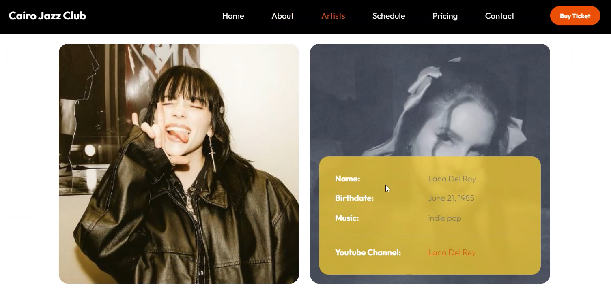

# 🪩👯‍♂️CJazz - Concert Management System

Cairo Jazz Club Management System is a web application designed to streamline the management of concerts and events at CJazz Club. It provides users with access to the schedule of parties, information about bands and artists collaborating with the club, and allows the club manager to set payment plans and access comprehensive data.

Club managers have access to features for setting plans, managing payments, and overseeing all aspects of the club's operations.

Users have access to information about the bands and artists collaborating with the club.

Users can view the upcoming concerts and events at Cairo Jazz Club.

Users can easily get in touch with club managers for inquiries, collaboration opportunities, or issue resolution.

---

`Django` `Django-ORM` `PostgreSQL`

*Entity relational diagram*

---
*User access throw our active artists infornmation*

*User access throw our parties schedule*

*User access throw our ticket planes*

---

*Example of admin roles in adding artist and he can make it active or not based on the policy and joining payment.*

*Adding Artits*

*Admin control throw parties*

